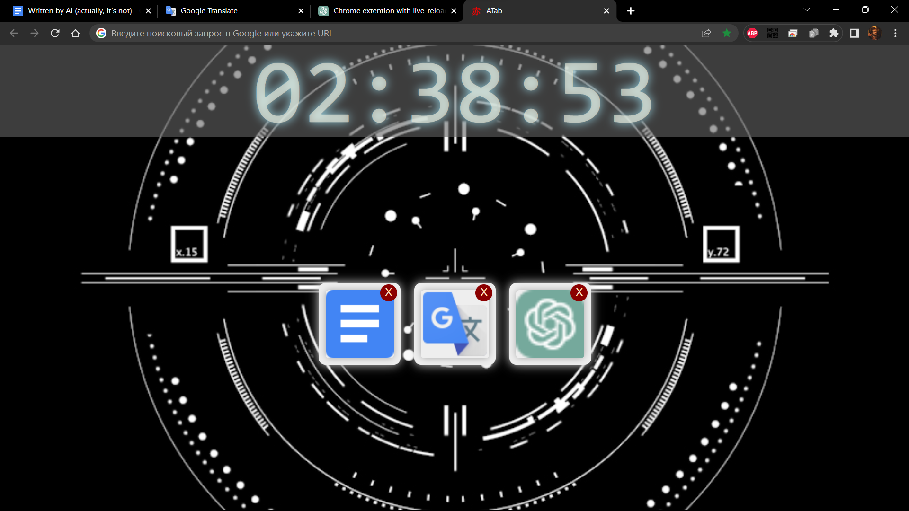

# Awesome Tab
### Chrome Extension for Awesome people 
Replaces your NewTab and Homepage in Chrome Browser.

[comment]: <> ([Alternative version]&#40;https://a13ks3y.github.io/ATab/index.html&#41; - for mobile, to set up it as home page.)



## Installation

Go to Releases. Do something. Do something else. Don't complain. Be strong. Give up.

## ToDo:

### Extention:
- refactor and unit-test keyboard handling (now it's a mess)
- mouse events handler for bookmars and folders
- add folder icon, or something, to show it's a folder, not a bookmark
- href should not be undefined for the folder (think about what it should be?)
- add close-tab animation (when close tab button clicked)
- Tab/Shit+Tab and arrows navigation between opened tabs
- List of bookmarks (create specific folder for this purpose?)
- "Close others" button, to close all tabs, except current/selected
#### Landing page (gh-pages branch):
- use ````javascript location.hash.substr(1).split('-').map(str => String.fromCodePoint(parseInt(str, 16))); ```` if present for sharing feature.

## 🛣 Road-Map
- Implement the bookmarks panel!
- ~~Get rid of useless css/js libs and legacy code.~~
- ~~Refactor html markup of override page~~
- ~~Get rid of settings, or re-develop it.~~


### Some Useful Notes:

````shell
npm i --legacy-peer-deps && npm run build
````

Then in browser "add unpucked extention", choose the "dist" folder.
